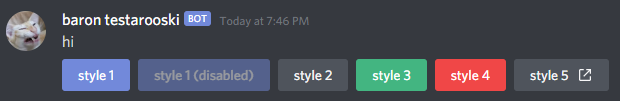

### Bot Components

Provides the ability for bots to allow user interactions by clicking on buttons  
  
Bots can create components by adding a `components` array (of component objects) to the Create Message endpoint  
  
Clicking a button causes a POST to Create Interaction with the `data` field being an object containing keys `component_type` (integer) and `custom_id` (string) 

#### Component Object

| Field      | Type                              | Description                              |
| type       | [component type](#component-type) | type of the component                    |
| style?     | integer                           | [style](#component-styles) of the button |
| custom_id? | string                            | unique id for the button                 |
| label?     | string                            | label of the button                      |
| url?       | string                            | url to be opened when clicked            |
| disabled?  | bool                              | should the button be disabled            |

the API will error if a `url` is provided saying a `custom_id` is required, but adding a `custom_id` will cause an error saying they are mutually exclusive

#### Component Type

| Name       | Value |
| collection | 1     |
| button     | 2     |

#### Component Styles

| Name         | Value | Notes        |
| blue/brand   | 1     |              |
| gray/primary | 2     |              |
| green        | 3     |              |
| red          | 4     |              |
| url          | 5     | requires url |

