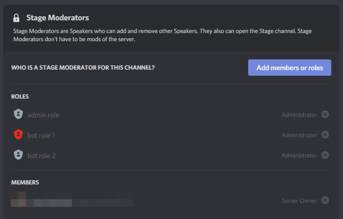

* auto-gen TOC:
{:toc}

### Thread Channels

Drafted [here](https://github.com/discord/discord-api-docs/pull/2693)

Used for ephemeral conversations started from existing channels. Can also be manually archived

Channel Types:  
PUBLIC_THREAD = 11  
PRIVATE_THREAD = 12  

<details>
	<summary>show images</summary>
	
	
</details>
&nbsp;  

### Stage Channels
  
Presumably used for allowing limited numbers of members to speak at a given time controlled by "Stage Moderators." Users can raise their hands

Channel Type: GUILD_STAGE_VOICE = 13

<details>
	<summary>show images</summary>
	
	
	
</details>
&nbsp;  

### Role Member Counts

Retrieves the number of members with each role  
[GitHub issue](https://github.com/discord/discord-api-docs/issues/2610#issuecomment-778985709)

GET `/api/guilds/{guild.id}/roles/member-counts`  
Returns json object where the key is the role ID and the value is the number of members  
  
  
Example (using the Discord API guild):  
GET `https://discord.com/api/v8/guilds/81384788765712384/roles/member-counts`  
```
{
  "585569508501094449": 14,
  "159592059873787904": 45,
  "254077236989132800": 7,
  "187053776920641536": 420,
  "233981945279807488": 33
  trimmed...
}
```

### User Affinities

Unknown. Presumably values indicating who the user communicates with most  

GET `https://discord.com/api/v8/users/@me/affinities/users`  

Returns:

| Field           | Type                                                    | Description             |
|-----------------|---------------------------------------------------------|-------------------------|
| user_affinities | array of [user affinity](#user-affinity-object) objects | list of user affinities |
|

#### User Affinity Object

| Field    | Type           | Description              |
|----------|----------------|--------------------------|
| user_id  | snowflake      | the id of the user       |
| affinity | decimal number | the affinity of the user |
|

### Guild Affinities

Unknown. Presumably values indicating what guilds the user communicates in the most  

GET `https://discord.com/api/v8/users/@me/affinities/guilds`  

Returns:

| Field            | Type                                                      | Description              |
|------------------|-----------------------------------------------------------|--------------------------|
| guild_affinities | array of [guild affinity](#guild-affinity-object) objects | list of guild affinities |
|

#### Guild Affinity Object

| Field    | Type           | Description              |
|----------|----------------|--------------------------|
| guild_id | snowflake      | the id of the guild       |
| affinity | decimal number | the affinity of the guild |
|
