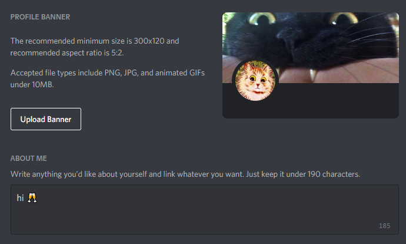
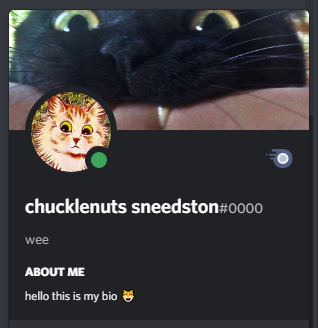
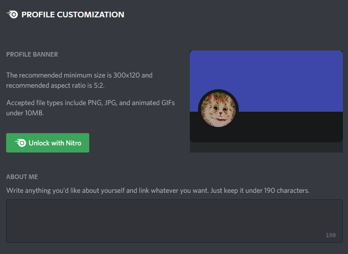
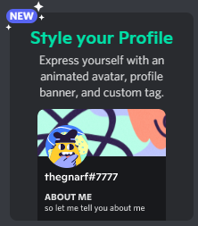
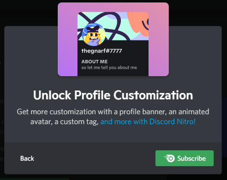

Discord is adding new features to Nitro. One of these (potential) changes is profile customization though free users may use bios (so far)

	
<strong>show images</strong>

	
	
	
	
	

#### Modify Profile
Customizing the profile extends the [Modify Current User](https://discord.com/developers/docs/resources/user#modify-current-user) endpoint with the following fields:

| Field  | Type                    | Description                         |
|--------|-------------------------|-------------------------------------|
| bio    | string                  | the "about me" field/user biography |
| banner | base64 encoded data URI | the profile banner                  |

These fields are also present (potentially as null) in the `user` field as returned by the [Get User Profile](./profile#get-user-profile) endpoint. `banner` will be a hash (string) in this case

The user's banner banner can be accessed via the url  
`https://cdn.discordapp.com/banners/{user id}/{banner hash here}.{ext}`  
It also accepts the size query parameter
