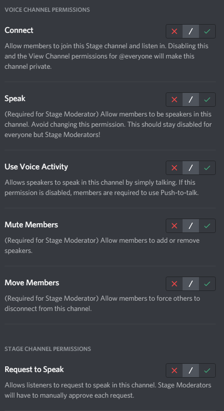
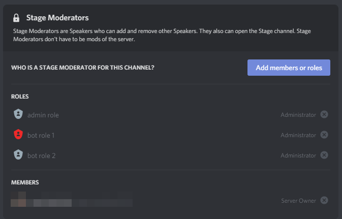

### Stage Channels
  
Stages are a special type of voice channel where members are organized into speakers, audience, and stage moderators. Stage moderators are speakers themselves and can manage the stage including speakers and the audience. The audience listens to the speaker or speakers and can also have the ability to raise their hands in order to request to speak.

#### Channel Types:

| Type              | Value |
|-------------------|-------|
| GUILD_STAGE_VOICE | 13    |

	
<strong>show images</strong>

	
	
	

