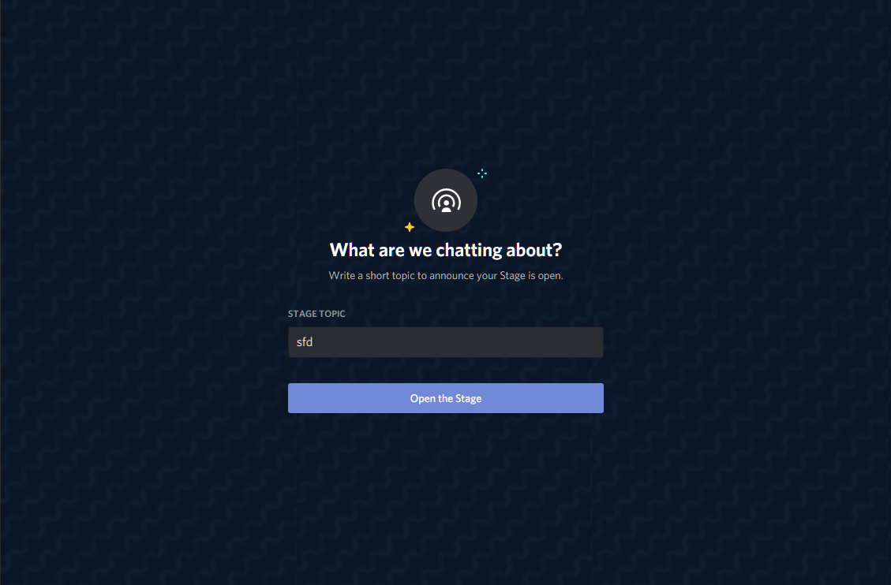

## Stage Channels will be officially documented (soon)
See [this PR](https://github.com/discord/discord-api-docs/pull/2751)  

### Stage Channels
  
Stages are a special type of voice channel where members are organized into speakers, audience, and stage moderators. Stage moderators are speakers themselves and can manage the stage including speakers and the audience. The audience listens to the speaker or speakers and can also have the ability to raise their hands in order to request to speak.

After creating a stage voice channel it can be "started" by issuing [Modify Channel](https://discord.com/developers/docs/resources/channel#modify-channel) with the `topic` parameter set  
  
#### Change Stage Voice State
PATCH `/guilds/{guild.id}/voice-states/{user.id}`  
{user.id} can be substituted with `@me` when operating on yourself  
JSON parameters:

| Field                       | Type      | Description                       |
|-----------------------------|-----------|-----------------------------------|
| channel_id                  | snowflake | channel to request to speak in    |
| request_to_speak_timestamp? | ?string   | current ISO-8601 timestamp        |
| suppress?                   | bool      | whether to suppress speech or not |

To change your speaker status as a stage moderator:  
`request_to_speak_timestamp` = null  
`suppress` = false/true
  
To change someone else's speaker status as stage moderator:  
`suppress` = false/true  

To request to speak:  
set `request_to_speak_timestamp`

#### Channel Types:

| Type              | Value |
|-------------------|-------|
| GUILD_STAGE_VOICE | 13    |

	
<strong>show images</strong>

	
	
	
	
	
	
	

