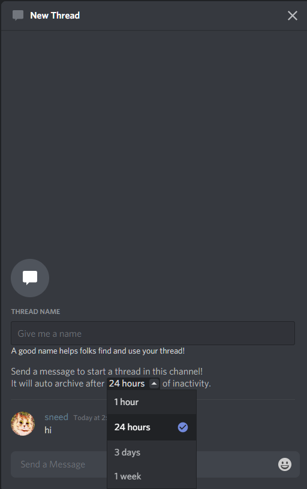

### Thread Channels

Drafted [here](https://github.com/discord/discord-api-docs/pull/2693)

Used for ephemeral conversations started from existing channels. Users can join and leave threads. Can also be manually archived and unarchived

#### Create Thread

POST `/channels/{channel.id}/messages/{message.id}/threads`  
Creates a new thread starting in a channel attached to the given message.  
Unknown return  
JSON parameters:

| Field                 | Type   | Description                                                  |
|-----------------------|--------|--------------------------------------------------------------|
| auto_archive_duration | int    | minutes until the thread should be archived after inactivity |
| name                  | string | name of the thread                                           |
| type                  | int    | thread channel type. see [channel types](#channel-types)     |

#### Join Thread

POST `/channels/{thread.id}/thread-members/@me`  

#### Add Member to Thread

POST `/channels/{thread.id}/thread-members/{user.id}`

#### Leave Thread

DELETE `/channels/{thread.id}/thread-members/@me`

#### Modify Thread

PATCH `/channels/{thread.id}`  
JSON parameters:

| Field                  | Type    | Description                                               |
|------------------------|---------|-----------------------------------------------------------|
| archived?              | bool    | should the thread be archived                             |
| auto_archive_duration? | integer | minutes of inactivity until the thread should be archived |

#### Modify Notification Settings

PATCH `/channels/{thread.id}/thread-members/@me/settings`  
JSON parameters:

| Field | Type                                        | Description        |
|-------|---------------------------------------------|--------------------|
| flags | [thread member flags](#thread-member-flags) | notification flags |

#### Thread Member Flags

| Flag             | Value  |
|------------------|--------|
| HAS_PARTICIPATED | 1 << 0 |
| ALL_MESSAGES     | 1 << 1 |
| ONLY_MENTIONS    | 1 << 2 |
| NO_MESSAGES      | 1 << 3 |

#### Channel Types

| Type           | Value |
|----------------|-------|
| PUBLIC_THREAD  | 11    |
| PRIVATE_THREAD | 12    |

#### Message Types

| Type                   | Value |
|------------------------|-------|
| THREAD_STARTER_MESSAGE | 21    |

#### Message Flags

| Flag       | Value  |
|------------|--------|
| HAS_THREAD | 1 << 5 |

#### Dispatch events
* THREAD_CREATE
* THREAD_UPDATE
* THREAD_DELETE
* THREAD_LIST_SYNC
* THREAD_MEMBER_UPDATE
* THREAD_MEMBERS_UPDATE
  
Channel objects may contain the field `thread_metadata` as described below:

#### Thread Metadata Object

| Field                 | Type      | Description                                                  |
|-----------------------|-----------|--------------------------------------------------------------|
| archived              | bool(?)   | ?                                                            |
| auto_archive_duration | integer   | minutes until the thread should be archived after inactivity |
| archiver_id?          | snowflake | the id of the user who archived the thread                   |
| archive_timestamp(?)  | ?         | ?                                                            |

Guild objects may also contain the field `threads`, an array, whose structure is currently unknown

	
<strong>show images</strong>

	
	
	

